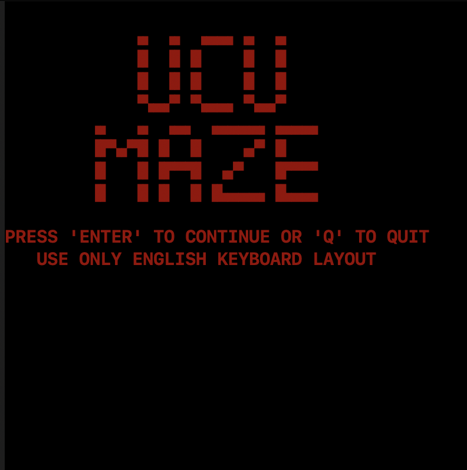

# UCU MAZE GAME




## Project Description

This game is a university project that implements a maze in which the player must decrypt all enemies and find the exit. The game is written without using additional libraries, except for the built-in `curses` library for text interface handling.

## Features

- **Interactive Maze:** The player navigates through the maze using the "WASD" keys.
- **Combat with Enemies:** The player can shoot enemies by pressing the spacebar. Enemies are represented by the symbol "?".
- **Statistics:** During the game, the number of remaining bullets and active enemies is displayed.
- **Win Conditions:** The player wins by decrypting all enemies and finding the exit.

## How to Run the Game

1. Clone the repository to your computer.
2. Open a terminal and navigate to the project directory.
3. Run the following command:

```bash
   python main.py
```
